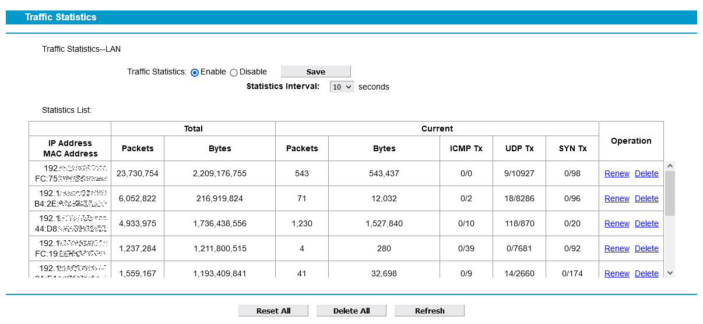

# tplinkstat
Web app for visualization traffic statistic from TP-LINK routers.
- Top 10 chart by used traffic, top 10 chart by current speed, speed timeline stacked diagram and summary table.
- Dark and light theme.
- Ready for mobile devices responsive design.
- Speed units switching - bits/s or bytes/s.

| tplinkstat screenshot                      | built-in Traffic Statistics screenshot             |
| ------------------------------------------ | -------------------------------------------------- |
|  |  |

## Tested with
#### Work
- TP-Link TD-W8980
- TP-Link TL-WR840N (not fully confirmed) - router does not finish own connections to statistic, only by timeout
#### Not worked
- TP-Link Archer A6 4.0 - completely different type of authorization and encrypted response data

## Requirements
- TP-LINK router.
- Web server with php.

## Usage
- Copy web app files to your web-server folder.
- Edit 'connector_config.php' for your router url and password.
- Enable 'Traffic Statistics' in your router settings.
- Also, you can edit 'tplinkstat_config.js' for change some visual settings and naming your network devices.

## Notes
- If your router show incorrect statistic - enable Bandwidth Control.
- I also saw next recommendation, but in my case it was not needed.
	> After being in contact with tp-link techsupport iv'e found out that for Traffic Monitor to function properly you have to have either set QoS to something other than Standard or set at least one client as High Priority.
- Typically routers use non-encrypted web-interface (http), username and password for router admin panel transmitted over the network encoded with base64, same as browser. I not recommend use this app inside networks where your traffic can be sniffed.
- TP-LINK router count IN and OUT traffic summary in one field and maximum number for this field is 4294967296 = 4.29GB = 4GiB.
- IN and OUT speed also count in one field summary - this is why the displayed speed may exceed the maximum for your provider's tariff plan.
- Some routers allow only one login to control panel at the same time, all other connection blocked.

## Used
**Libs:** [jquery](https://jquery.com/) [bootstrap](https://getbootstrap.com/) [bootstrap-table](https://bootstrap-table.com/) [chartjs](https://www.chartjs.org/) [luxon](https://moment.github.io/luxon/) [chartjs-adapter-luxon](https://github.com/chartjs/chartjs-adapter-luxon)

**Icon:** [veryicon](https://www.veryicon.com/)

## Disclaimer
This software is free and provided "as is" without any warranty. The author assumes no responsibility for any moral or material damage caused by the use of this software, any loss of profit as a result of or during use.

## Thank you for using
If you like this app

